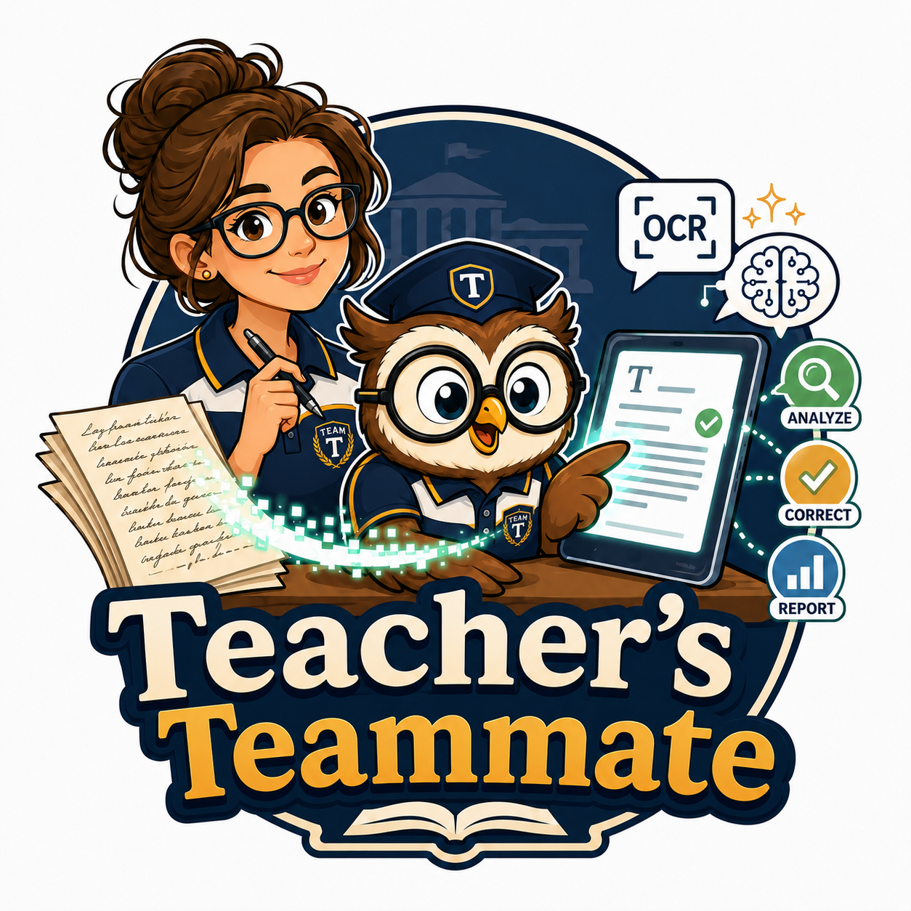

# Teacher's Teammate

<div align="center">
  
</div>

Teacher's Teammate is a batch OCR pipeline that extracts text from scanned documents (PDFs and images) and plain text files (TXT), then produces proofread DOCX reports. It supports the full digitization workflow: OCR, optional anonymization of personal data before any cloud processing, LLM-based text correction, and evaluation of correction quality. The application ships as a PySide6 desktop GUI and a command-line tool.

---

## Quick start

Download the installer for your platform from the releases page and run it. Once installed, launch **Teacher's Teammate** from the Start menu (Windows), the Applications folder (macOS), or via `teachers-teammate-gui` from the terminal.

Teacher's Teammate uses [Ollama](https://ollama.com) for OCR by default. Install Ollama separately if it is not already running on your machine, then pull an OCR model:

```bash
ollama pull deepseek-ocr:latest
```

Optional components — PII anonymization (spaCy), PaddleOCR, GPU monitoring, and spaCy language models — can be installed directly from within the desktop app; no terminal required.

For full setup instructions and alternative OCR engines, see [docs/index.md](docs/index.md).

---

## Documentation

| Guide | Contents |
|---|---|
| [docs/index.md](docs/index.md) | Introduction, program flow, quick start |
| [docs/advanced_user_guide.md](docs/advanced_user_guide.md) | OCR engines, preprocessing, correction/evaluation, model/provider selection |
| [docs/development.md](docs/development.md) | Development workflows, architecture, lint/test/docs commands |
| [docs/testing.md](docs/testing.md) | Running tests, test structure, Given-When-Then convention |

---

## Development

The project uses [Bazel](https://bazel.build/) as the build system for linting, testing, and documentation.

**Lint**

```bash
bazel test //:py_ruff
bazel test //:py_pylint
```

**Tests**

```bash
bazel test //tests/...
```

**Build docs**

```bash
bazel build //docs:html
bazel run //docs:html.serve
```

---

## Credits

- [Ollama-OCR](https://github.com/imanoop7/Ollama-OCR) by imanoop7 — inspired this project
- [Ollama](https://ollama.com) — local LLM inference runtime
- [LangChain](https://github.com/langchain-ai/langchain) — LLM abstraction layer
- [Tesseract OCR](https://github.com/tesseract-ocr/tesseract) — open-source OCR engine

---

## License

Teacher's Teammate is released under the **Apache License 2.0** — see [LICENSE](LICENSE)
and [NOTICE](NOTICE).

The distributed application bundles the Qt GUI toolkit via **PySide6**, which is used
under the **GNU LGPL v3 (LGPL-3.0)**. Qt is dynamically linked: the installer ships the
Qt shared libraries and the app loads them at runtime, so you may replace them with a
compatible build. The full source is public, satisfying the LGPL relink requirement.
Full license and notice texts for every bundled third-party component are reproduced in
[third_party_licenses/third_party_license.txt](third_party_licenses/third_party_license.txt)
and in the app's **Third-Party Licenses** dialog.

Optional OCR/LLM/privacy features (LangChain, spaCy, PaddleOCR, …) are **not** bundled —
they are installed on demand and are governed by their own licenses.
